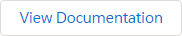
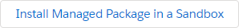
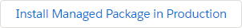
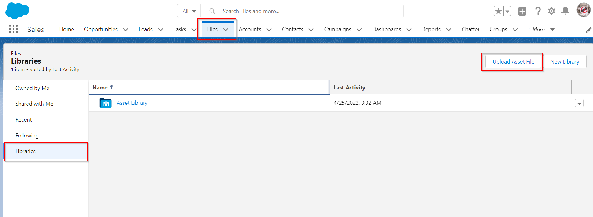
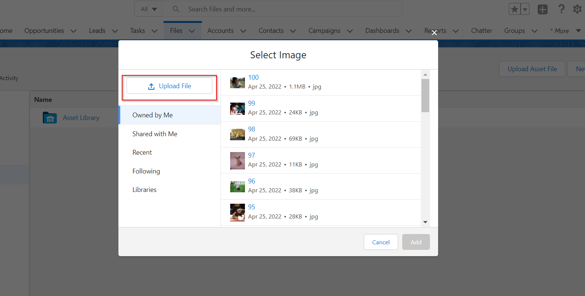
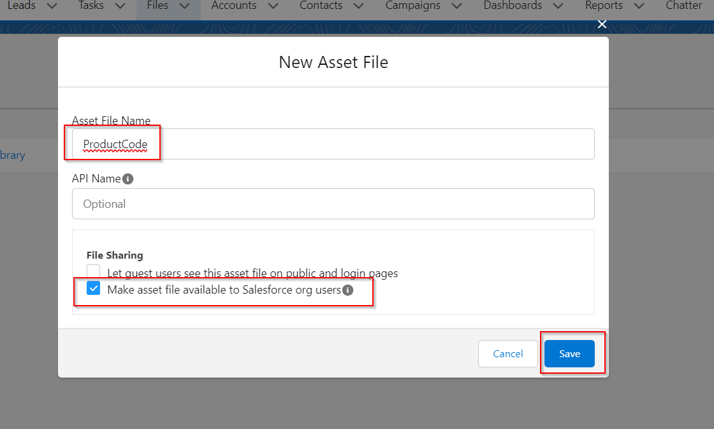
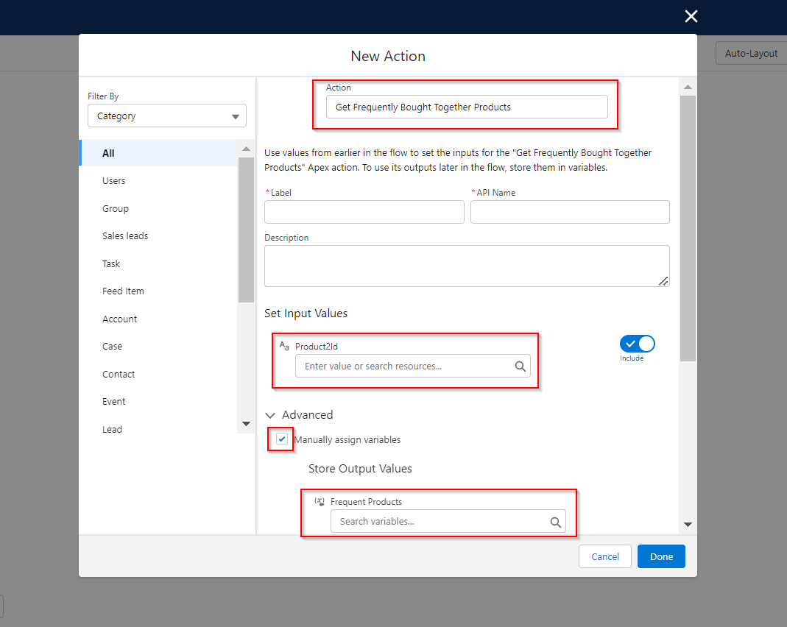

# Frequently Bought Together Products for Salesforce

[](https://github.com/jongpie/NebulaLogger/actions/workflows/build.yml)
[](https://codecov.io/gh/justindixon/RelatedProducts)

Top 5 Products Frequently Bought Together

## Unlocked Package - v1.0.0

[](https://test.salesforce.com/packaging/installPackage.apexp?p0=)
[](https://login.salesforce.com/packaging/installPackage.apexp?p0=)
[](https://justindixon.github.io/RelatedProducts/)

## Managed Package - v1.0.0

[](https://test.salesforce.com/packaging/installPackage.apexp?mgd=true&p0=)
[](https://login.salesforce.com/packaging/installPackage.apexp?mgd=true&p0=)
[](https://github.com/justindixon/RelatedProducts/milestone/1)

---

## Features

1. Lightning Web Component showing frequently bought together products.
2. Flow Action available to return the top 5 frequently bought products.
3. Works only with Order Products for now.

## Road Map

1. Enable For Opportunity Products.
2. Enable for CPQ Quote Line Products.
3. Units Tests for LWC.
4. Enable additional file types (other than .jpq).
5. Custom Object to hold the top 5 related products.
6. Scheduled Batch Job to maintain the top 5 related products every night.
7. Image resizing functionality.
8. Completely custom build the carousel component. (Salesforce's is a bit limited, and hard to change).

---

<!--## Installing

Related Products is available as both an unlocked package and a managed package. The metadata is the same in both packages, but there are some differences in the available functionality & features. All examples in `README` are for the unlocked package (no namespace) - simply add the `Nebula` namespace to the examples if you are using the managed package.

<table>
    <thead>
        <tr>
            <th></th>
            <th>Unlocked Package (Recommended)</th>
            <th>Managed Package</th>
        </tr>
    </thead>
    <tbody>
        <tr>
            <td>Namespace</td>
            <td>none</td>
            <td><code></code></td>
        </tr>
        <tr>
            <td>Future Releases</td>
            <td>Faster release cycle: new patch versions are released (e.g., <code>v4.4.x</code>) for new enhancements & bugfixes that are merged to the <code>main</code> branch in GitHub</td>
            <td>Slower release cycle: new minor versions are only released (e.g., <code>v4.x</code>) once new enhancements & bugfixes have been tested and code is stabilized</td>
        </tr>
        <tr>
            <td>Public & Protected Apex Methods</td>
            <td>Any <code>public</code> and <code>protected</code> Apex methods are subject to change in the future - they can be used, but you may encounter deployment issues if future changes to <code>public</code> and <code>protected</code> methods are not backwards-compatible</td>
            <td>Only <code>global</code> methods are available in managed packages - any <code>global</code> Apex methods available in the managed package will be supported for the foreseeable future</td>
        </tr>
    </tbody>
</table>

---
--->

## Getting Started

After deployment, assign permission set `Related Products Viewer` to users. Provides access to view the lightning component.

### Image Upload

Images need to be sized into the dimensions you require. Recommended is 240x320.

Images need to be uploaded as Content Assets.

[]
[]

The name of the Content Asset must match the Product Code that you want the image to display for.

[]

---

### Related Products Lightning Components: Quick Start

---

### Related Products Flow Action: Quick Start

[]

In your Flow you must input a single Product2 record Id. The top 5 most frequently bought products to the input Product will be returned as a list of Products.

---

### Related Products Apex Class: Quick Start

You can call the class through Apex:

```
List<FrequentlyBoughtTogether.request> rqts = new List<FrequentlyBoughtTogether.request>();FrequentlyBoughtTogether.request rqt = new FrequentlyBoughtTogether.request();
rqt.Product2Id = product2Id;
rqts.add(rqt);
List<FrequentlyBoughtTogether.Result> rslts = FrequentlyBoughtTogether.freqProds(rqts);
List<Product2> rsltsProducts = rslts[0].frequentProducts;
```

---
